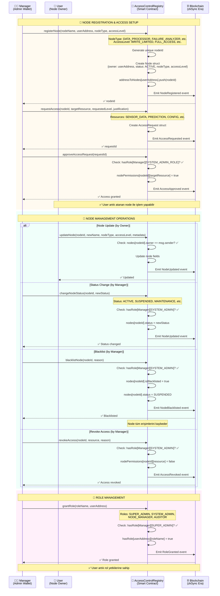
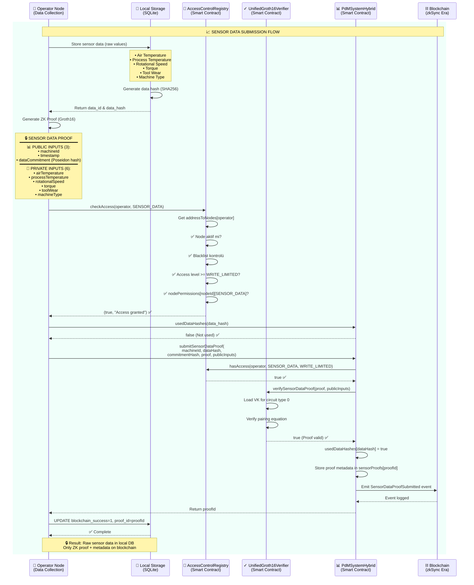
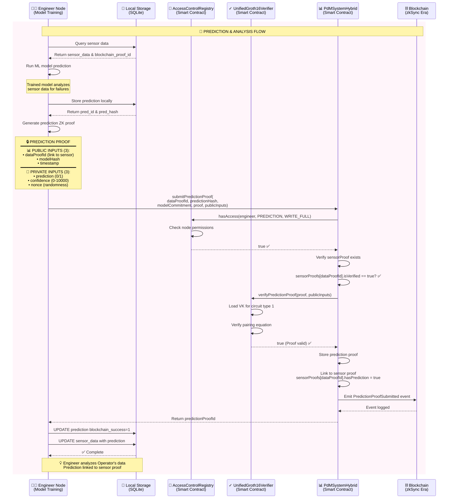

# PDM System - Sequence Diagrams

Bu dosya, PDM sisteminin farklı süreçlerini gösteren modüler sequence diyagramlarını içerir.

---

## 📋 İçindekiler

1. [Node Management & Access Control](#1-node-management--access-control) - Node kayıt, güncelleme, rol atama
2. [Sensor Data Submission](#2-sensor-data-submission) - Sensör verisi gönderme
3. [Prediction Submission](#3-prediction-submission) - Tahmin analizi

---

## 1. Node Management & Access Control

Genel node yönetim süreci: kayıt, erişim kontrolü ve yönetim işlemleri.


```mermaid
sequenceDiagram
    participant Manager as 👨‍💼 Manager<br/>(Admin Wallet)
    participant User as 👤 User<br/>(Node Owner)
    participant AC as 🔐 AccessControlRegistry<br/>(Smart Contract)
    participant BC as ⛓️ Blockchain<br/>(zkSync Era)

    rect rgb(255, 250, 240)
    Note over Manager,BC: 📝 NODE REGISTRATION & ACCESS SETUP
    
    Manager->>AC: registerNode(nodeName, userAddress, nodeType, accessLevel)
    Note over AC: NodeType: DATA_PROCESSOR, FAILURE_ANALYZER, etc.<br/>AccessLevel: WRITE_LIMITED, FULL_ACCESS, etc.
    AC->>AC: Generate unique nodeId
    AC->>AC: Create Node struct<br/>{owner: userAddress, status: ACTIVE, nodeType, accessLevel}
    AC->>AC: addressToNodes[userAddress].push(nodeId)
    AC->>BC: Emit NodeRegistered event
    BC-->>Manager: ✅ nodeId
    
    Manager->>AC: requestAccess(nodeId, targetResource, requestedLevel, justification)
    Note over AC: Resources: SENSOR_DATA, PREDICTION, CONFIG, etc.
    AC->>AC: Create AccessRequest struct
    AC->>BC: Emit AccessRequested event
    BC-->>Manager: ✅ requestId
    
    Manager->>AC: approveAccessRequest(requestId)
    AC->>AC: Check: hasRole[Manager][SYSTEM_ADMIN_ROLE]? ✅
    AC->>AC: nodePermissions[nodeId][targetResource] = true
    AC->>BC: Emit AccessApproved event
    BC-->>Manager: ✅ Access granted
    
    Note over User,BC: ✅ User artık atanan node ile işlem yapabilir
    end

    rect rgb(240, 255, 250)
    Note over Manager,BC: 🔄 NODE MANAGEMENT OPERATIONS
    
    alt Node Update (by Owner)
        User->>AC: updateNode(nodeId, newName, nodeType, accessLevel, metadata)
        AC->>AC: Check: nodes[nodeId].owner == msg.sender? ✅
        AC->>AC: Update node fields
        AC->>BC: Emit NodeUpdated event
        BC-->>User: ✅ Updated
    
    else Status Change (by Manager)
        Manager->>AC: changeNodeStatus(nodeId, newStatus)
        Note over AC: Status: ACTIVE, SUSPENDED, MAINTENANCE, etc.
        AC->>AC: Check: hasRole[Manager][SYSTEM_ADMIN]? ✅
        AC->>AC: nodes[nodeId].status = newStatus
        AC->>BC: Emit NodeUpdated event
        BC-->>Manager: ✅ Status changed
    
    else Blacklist (by Manager)
        Manager->>AC: blacklistNode(nodeId, reason)
        AC->>AC: Check: hasRole[Manager][SYSTEM_ADMIN]? ✅
        AC->>AC: nodes[nodeId].isBlacklisted = true
        AC->>AC: nodes[nodeId].status = SUSPENDED
        AC->>BC: Emit NodeBlacklisted event
        BC-->>Manager: ✅ Blacklisted
        Note over AC: Node tüm erişimlerini kaybeder
    
    else Revoke Access (by Manager)
        Manager->>AC: revokeAccess(nodeId, resource, reason)
        AC->>AC: Check: hasRole[Manager][SYSTEM_ADMIN]? ✅
        AC->>AC: nodePermissions[nodeId][resource] = false
        AC->>BC: Emit AccessRevoked event
        BC-->>Manager: ✅ Access revoked
    end
    end

    rect rgb(255, 240, 250)
    Note over Manager,BC: 👑 ROLE MANAGEMENT
    
    Manager->>AC: grantRole(roleName, userAddress)
    Note over AC: Roles: SUPER_ADMIN, SYSTEM_ADMIN,<br/>NODE_MANAGER, AUDITOR
    AC->>AC: Check: hasRole[Manager][SUPER_ADMIN]? ✅
    AC->>AC: hasRole[userAddress][roleName] = true
    AC->>BC: Emit RoleGranted event
    BC-->>Manager: ✅ Role granted
    
    Note over Manager,BC: ✅ User artık rol yetkilerine sahip
    end
```

---

## 2. Sensor Data Submission

Operatör tarafından sensör verisi toplama ve blockchain'e gönderme.


```mermaid
sequenceDiagram
    participant Operator as 👷 Operator Node<br/>(Data Collection)
    participant Storage as 💾 Local Storage<br/>(SQLite)
    participant AC as 🔐 AccessControlRegistry<br/>(Smart Contract)
    participant Ver as ✓ UnifiedGroth16Verifier<br/>(Smart Contract)
    participant PDM as 📊 PdMSystemHybrid<br/>(Smart Contract)
    participant BC as ⛓️ Blockchain<br/>(zkSync Era)

    rect rgb(240, 255, 250)
    Note over Operator,BC: 📈 SENSOR DATA SUBMISSION FLOW
    
    Operator->>Storage: Store sensor data (raw values)
    Note over Storage: • Air Temperature<br/>• Process Temperature<br/>• Rotational Speed<br/>• Torque<br/>• Tool Wear<br/>• Machine Type
    Storage->>Storage: Generate data hash (SHA256)
    Storage-->>Operator: Return data_id & data_hash
    
    Operator->>Operator: Generate ZK Proof (Groth16)
    Note over Operator: 🔒 SENSOR DATA PROOF<br/>━━━━━━━━━━━━━━━━━━━━━━━━<br/>📊 PUBLIC INPUTS (3):<br/>  • machineId<br/>  • timestamp<br/>  • dataCommitment (Poseidon hash)<br/>━━━━━━━━━━━━━━━━━━━━━━━━<br/>🔐 PRIVATE INPUTS (6):<br/>  • airTemperature<br/>  • processTemperature<br/>  • rotationalSpeed<br/>  • torque<br/>  • toolWear<br/>  • machineType
    
    Operator->>AC: checkAccess(operator, SENSOR_DATA)
    AC->>AC: Get addressToNodes[operator]
    AC->>AC: ✅ Node aktif mi?
    AC->>AC: ✅ Blacklist kontrolü
    AC->>AC: ✅ Access level >= WRITE_LIMITED?
    AC->>AC: ✅ nodePermissions[nodeId][SENSOR_DATA]?
    AC-->>Operator: (true, "Access granted") ✅
    
    Operator->>PDM: usedDataHashes(data_hash)
    PDM-->>Operator: false (Not used) ✅
    
    Operator->>PDM: submitSensorDataProof(<br/>machineId, dataHash,<br/>commitmentHash, proof, publicInputs)
    
    PDM->>AC: hasAccess(operator, SENSOR_DATA, WRITE_LIMITED)
    AC-->>PDM: true ✅
    
    PDM->>Ver: verifySensorDataProof(proof, publicInputs)
    Ver->>Ver: Load VK for circuit type 0
    Ver->>Ver: Verify pairing equation
    Ver-->>PDM: true (Proof valid) ✅
    
    PDM->>PDM: usedDataHashes[dataHash] = true
    PDM->>PDM: Store proof metadata in sensorProofs[proofId]
    PDM->>BC: Emit SensorDataProofSubmitted event
    BC-->>PDM: Event logged
    
    PDM-->>Operator: Return proofId
    
    Operator->>Storage: UPDATE blockchain_success=1, proof_id=proofId
    Storage-->>Operator: ✅ Complete
    
    Note over Operator,Storage: 🔒 Result: Raw sensor data in local DB<br/>Only ZK proof + metadata on blockchain
    end
```

---

## 3. Prediction Submission

Engineer tarafından ML model ile tahmin yapma ve blockchain'e gönderme.


```mermaid
sequenceDiagram
    participant Engineer as 👨‍🔧 Engineer Node<br/>(Model Training)
    participant Storage as 💾 Local Storage<br/>(SQLite)
    participant AC as 🔐 AccessControlRegistry<br/>(Smart Contract)
    participant Ver as ✓ UnifiedGroth16Verifier<br/>(Smart Contract)
    participant PDM as 📊 PdMSystemHybrid<br/>(Smart Contract)
    participant BC as ⛓️ Blockchain<br/>(zkSync Era)

    rect rgb(255, 245, 250)
    Note over Engineer,BC: 🎯 PREDICTION & ANALYSIS FLOW
    
    Engineer->>Storage: Query sensor data
    Storage-->>Engineer: Return sensor_data & blockchain_proof_id
    
    Engineer->>Engineer: Run ML model prediction
    Note over Engineer: Trained model analyzes<br/>sensor data for failures
    
    Engineer->>Storage: Store prediction locally
    Storage-->>Engineer: Return pred_id & pred_hash
    
    Engineer->>Engineer: Generate prediction ZK proof
    Note over Engineer: 🔒 PREDICTION PROOF<br/>━━━━━━━━━━━━━━━━━━━━━━━━<br/>📊 PUBLIC INPUTS (3):<br/>  • dataProofId (link to sensor)<br/>  • modelHash<br/>  • timestamp<br/>━━━━━━━━━━━━━━━━━━━━━━━━<br/>🔐 PRIVATE INPUTS (3):<br/>  • prediction (0/1)<br/>  • confidence (0-10000)<br/>  • nonce (randomness)
    
    Engineer->>PDM: submitPredictionProof(<br/>dataProofId, predictionHash,<br/>modelCommitment, proof, publicInputs)
    
    PDM->>AC: hasAccess(engineer, PREDICTION, WRITE_FULL)
    AC->>AC: Check node permissions
    AC-->>PDM: true ✅
    
    PDM->>PDM: Verify sensorProof exists
    PDM->>PDM: sensorProofs[dataProofId].isVerified == true? ✅
    
    PDM->>Ver: verifyPredictionProof(proof, publicInputs)
    Ver->>Ver: Load VK for circuit type 1
    Ver->>Ver: Verify pairing equation
    Ver-->>PDM: true (Proof valid) ✅
    
    PDM->>PDM: Store prediction proof
    PDM->>PDM: Link to sensor proof<br/>sensorProofs[dataProofId].hasPrediction = true
    PDM->>BC: Emit PredictionProofSubmitted event
    BC-->>PDM: Event logged
    
    PDM-->>Engineer: Return predictionProofId
    
    Engineer->>Storage: UPDATE prediction blockchain_success=1
    Engineer->>Storage: UPDATE sensor_data with prediction
    Storage-->>Engineer: ✅ Complete
    
    Note over Engineer,Storage: 💡 Engineer analyzes Operator's data<br/>Prediction linked to sensor proof
    end
```

---

## 📊 Diagram Özeti

| Diagram | Amaç | Ana Aktörler | Temel İşlemler |
|---------|------|--------------|----------------|
| **1. Node Management & Access Control** | Node kayıt, güncelleme, rol atama, erişim yönetimi | Manager, Operator, Engineer | Node kayıt/güncelleme, izin verme/iptal, blacklist, rol atama |
| **2. Sensor Data Submission** | Sensör verisi toplama ve blockchain'e gönderme | Operator | Veri toplama, ZK proof oluşturma, blockchain gönderimi |
| **3. Prediction Submission** | Tahmin analizi ve blockchain'e gönderme | Engineer | Model çalıştırma, prediction proof, sensor proof linking |

---

## 🔗 Proof Zinciri

```
Sensor Proof (Operator)
    ↓ (linked by dataProofId)
Prediction Proof (Engineer)
```

Her proof bir öncekine bağlıdır ve blockchain'de doğrulanabilir bir zincir oluşturur.

---

## 🏗️ Mimari Bileşenler

1. **Local Storage (SQLite)**
   - Ham sensör verilerini saklar
   - Makine öğrenmesi modellerini saklar
   - Tahmin sonuçlarını saklar

2. **AccessControlRegistry (Smart Contract)**
   - Node kayıt yönetimi (Operator, Engineer)
   - Rol bazlı erişim kontrolü
   - Yetki seviyesi yönetimi (WRITE_FULL / WRITE_LIMITED)

3. **UnifiedGroth16Verifier (Smart Contract)**
   - ZK-SNARK proof doğrulama
   - Verification Key (VK) yönetimi
   - Farklı circuit tipleri için pairing kontrolü

4. **PdMSystemHybrid (Smart Contract)**
   - Sensör data proof'larını saklar
   - Tahmin proof'larını saklar
   - Proof'lar arası ilişkileri yönetir

5. **Blockchain (zkSync Era)**
   - Layer 2 ölçeklenebilirlik
   - Düşük gas maliyetleri
   - Hızlı işlem onayları

---

## 👥 Rol Bazlı Erişim Kontrolü

### **1. 👨‍💼 Manager Node (Yönetici)**
- **Sorumluluk:** Sistem kurulumu, node yönetimi, erişim kontrolü
- **Yetki Seviyesi:** `NODE_MANAGER_ROLE` / `ADMIN_ACCESS`
- **İşlemler:**
  - ✅ Node kayıt (Operator, Engineer)
  - ✅ Erişim izni verme/kaldırma
  - ✅ Access request onaylama
  - ✅ Sistem konfigürasyonu
- **AccessControl:** `NODE_MANAGER_ROLE`

### **2. 👨‍🔧 Engineer Node (Mühendis)**
- **Sorumluluk:** Model eğitimi, tahmin analizi
- **Yetki Seviyesi:** `WRITE_FULL` (tam erişim)
- **İşlemler:**
  - ✅ Model konfigürasyonu güncelleme
  - ✅ Eğitilmiş model kaydetme
  - ✅ Tahmin (prediction) proof'u gönderme
  - ✅ Sensor data sorgulama
- **AccessControl:** `hasAccess(engineer, CONFIG/PREDICTION, WRITE_FULL)`

### **3. 👷 Operator Node (Operatör)**
- **Sorumluluk:** Sensör veri toplama, makine izleme
- **Yetki Seviyesi:** `WRITE_LIMITED` (sınırlı erişim)
- **İşlemler:**
  - ✅ Sensör verisi toplama ve gönderme
  - ✅ ZK proof oluşturma
  - ❌ Model güncelleme (yetkisiz)
  - ❌ Config değiştirme (yetkisiz)
- **AccessControl:** `hasAccess(operator, SENSOR_DATA, WRITE_LIMITED)`

---

## 🔒 Gizlilik Modeli

- **Off-chain:** Ham sensör değerleri (6 parametre)
- **On-chain:** Sadece ZK proof + metadata (machineId, timestamp, dataCommitment)
- **Sonuç:** Tam veri gizliliği + blockchain doğrulaması
